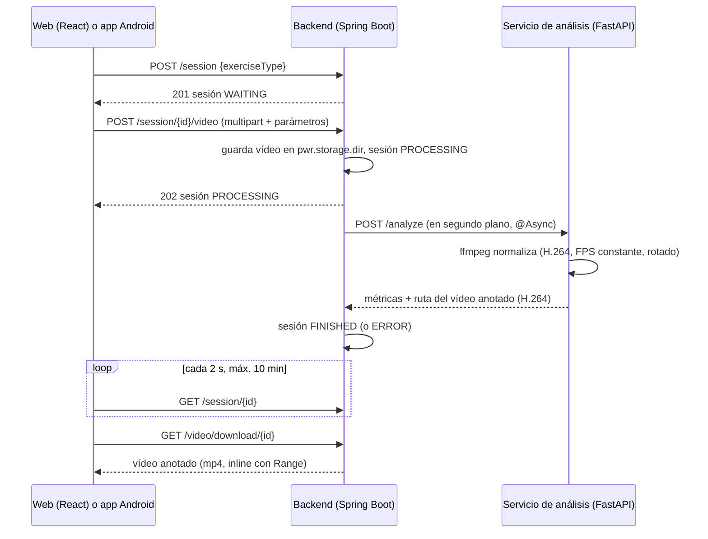
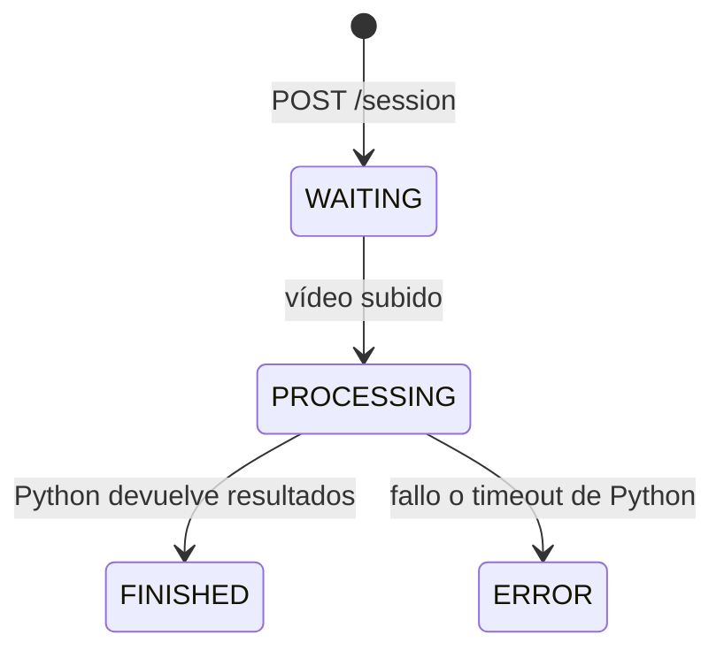

# Arquitectura de PwrMetrics

PwrMetrics (antes PowerMetrics) analiza vídeos de ejercicios con visión artificial: **sentadilla** y **salto vertical con contramovimiento (CMJ)**. La web (o la app Android) sube el vídeo, el backend Java orquesta el proceso y un servicio Python con MediaPipe extrae las métricas. Este documento es la referencia para retomar el desarrollo: qué hace cada pieza, cómo se comunican y cómo se ejecutan.

> Pendientes y deuda técnica: [PENDIENTES.md](PENDIENTES.md). Despliegue en un VPS: [DESPLIEGUE.md](DESPLIEGUE.md).

## Vista rápida

```mermaid
sequenceDiagram
    participant App as Web (React) o app Android
    participant BE as Backend (Spring Boot)
    participant PY as Servicio de análisis (FastAPI)

    App->>BE: POST /session {exerciseType}
    BE-->>App: 201 sesión WAITING
    App->>BE: POST /session/{id}/video (multipart + parámetros)
    BE->>BE: guarda vídeo en pwr.storage.dir, sesión PROCESSING
    BE-->>App: 202 sesión PROCESSING
    BE->>PY: POST /analyze (en segundo plano, @Async)
    PY->>PY: ffmpeg normaliza (H.264, FPS constante, rotado)
    PY-->>BE: métricas + ruta del vídeo anotado (H.264)
    BE->>BE: sesión FINISHED (o ERROR)
    loop cada 2 s, máx. 10 min
        App->>BE: GET /session/{id}
    end
    App->>BE: GET /video/download/{id}
    BE-->>App: vídeo anotado (mp4, inline con Range)
```

## Componentes

| Componente | Carpeta | Stack | Puerto |
|---|---|---|---|
| Web | `web/` | React 18, Vite 5, TypeScript, TanStack Query, React Router | 5173 en desarrollo |
| App móvil (congelada) | `FEPerfectSquat/` | Kotlin 2.2, Jetpack Compose, Retrofit 2.9, minSdk 24 | — |
| Backend | `BEPerfectSquat/` | Java 17, Spring Boot 3.4, JPA; H2 en memoria en local, PostgreSQL con el perfil `prod` | 8080 |
| Servicio de análisis | `PYAnalysisService/` | Python, FastAPI, MediaPipe 0.10.14, OpenCV, ffmpeg | 8000 |
| Proxy (producción) | `deploy/` | Caddy 2: HTTPS, sirve la web y pasa `/api/*` al backend | 80/443 |

## Backend (`BEPerfectSquat`)

Organizado en capas, de fuera hacia dentro:

| Capa | Paquete | Responsabilidad |
|---|---|---|
| API | `api/controller`, `api/dto`, `api/exception` | Adaptador HTTP, contrato público y mapeo de errores |
| Dominio | `domain/entity`, `domain/service`, `domain/repository`, `domain/enums` | Sesiones, vídeos, reglas de estado |
| Infraestructura | `infrastructure/client`, `infrastructure/service`, `infrastructure/config`, `infrastructure/web` | Cliente HTTP a Python, almacenamiento en disco, `RestTemplate`, CORS, pool de análisis, cookie de propietario y límite por IP |

> Las entidades JPA son a la vez modelo de dominio y de persistencia. No es arquitectura hexagonal estricta: el dominio depende de `AnalysisClient` y de `StorageService` sin puertos intermedios.

### Endpoints

Sin login: el filtro `ClientIdFilter` da a cada navegador una cookie anónima `pwr_cid` (UUID, `HttpOnly`, `SameSite=Lax`, `Secure` en `prod`, 1 año). Las sesiones guardan ese `ownerId` y todos los endpoints filtran por él: la sesión o el vídeo de otro navegador responde **404**.

| Método | Ruta | Respuesta | Uso |
|---|---|---|---|
| POST | `/session` | 201 `AnalysisSessionResponse` | Crea una sesión en `WAITING`. Body opcional `{"exerciseType": "SQUAT" o "VERTICAL_JUMP"}`; sin body, `SQUAT` |
| GET | `/session` | 200 `AnalysisSessionResponse[]` | Lista las sesiones de este navegador, la más reciente primero (Histórico y Estadísticas) |
| GET | `/session/{id}` | 200 `AnalysisSessionResponse` | Consulta estado y métricas, con `reps[]` (sentadilla) o `jumps[]` (salto); la app hace polling aquí |
| POST | `/session/{id}/video` | 202 `AnalysisSessionResponse` / 400 / 409 / 413 / 429 / 500 / 503 | Única subida: guarda el vídeo y lanza el análisis. Solo `.mp4 .mov .m4v .webm` (400); más de 200 MB → 413 `FILE_TOO_LARGE`; cola de análisis llena → 503 `ANALYSIS_BUSY` con `Retry-After: 60` y la sesión vuelve a `WAITING`. Parámetros opcionales: `weightKg` (barra, sentadilla, admite decimales), `bodyWeightKg` y `heightCm` (salto) |
| GET | `/video?sessionId=` | 200 `VideoResponse` | Datos del vídeo de una sesión |
| GET | `/video/download/{sessionId}` | 200/206 mp4 / 404 | Vídeo anotado con `Content-Disposition: inline` para `<video>`; admite `Range` |
| — | `/h2-console` | — | Consola de la base de datos (solo desarrollo; desactivada en `prod`) |

### Límites de uso

| Límite | Por defecto | Propiedad / variable | Al superarlo |
|---|---|---|---|
| Subidas por IP | 5/hora y 20/día | `pwr.rate-limit.upload-per-hour`, `upload-per-day` (`PWR_RATE_UPLOAD_PER_*`) | 429 `TOO_MANY_REQUESTS` + `Retry-After` |
| Sesiones creadas por IP | 30/hora | `pwr.rate-limit.create-per-hour` | 429 |
| Resto del API por IP | 120/min | `pwr.rate-limit.general-per-minute` | 429 |
| Tamaño de subida | 200 MB fichero, 210 MB petición | `spring.servlet.multipart.*` (`PWR_UPLOAD_MAX_*`) | 413 `FILE_TOO_LARGE` |
| Análisis simultáneos | 2 en curso + 10 en cola | `pwr.analysis.concurrency`, `queue-capacity` | 503 `ANALYSIS_BUSY` |
| Duración del vídeo | 60 s | `PWR_MAX_VIDEO_SECONDS` (servicio Python) | la sesión termina en `ERROR` |

El límite por IP usa Bucket4j con buckets en una caché Caffeine que caduca. Detrás de Caddy, `server.forward-headers-strategy=native` hace que `getRemoteAddr()` sea la IP real; Caddy sobrescribe cualquier `X-Forwarded-For` que mande el cliente.

CORS (`CorsConfig`) permite los orígenes de `pwr.cors.allowed-origins`. En producción la web y el API comparten dominio (`/api/*`), así que solo hace falta para el dev server o un API en subdominio.

### Ciclo de vida de una sesión

```mermaid
stateDiagram-v2
    [*] --> WAITING: POST /session
    WAITING --> PROCESSING: vídeo subido
    PROCESSING --> FINISHED: Python devuelve resultados
    PROCESSING --> ERROR: fallo o timeout de Python
```

- Solo se acepta vídeo en `WAITING`; en otro estado responde 409 `INVALID_STATE` con el estado actual.
- Vídeo vacío: 400 `BAD_REQUEST` con el motivo. Fallo al escribir o leer en disco: 500 `STORAGE_ERROR` (`StorageException`).
- Rangos válidos (`AnalysisParameters`): `weightKg` 0–500, `bodyWeightKg` 20–300, `heightCm` 100–250. Fuera de rango responde 400 `INVALID_PARAMETERS` con el motivo.
- Solo se guardan resultados en `PROCESSING`; en otro estado responde 409.
- `AnalysisRunner.analyze` corre en otro hilo (`@EnableAsync`). Cualquier excepción deja la sesión en `ERROR`.
- Timeouts hacia Python: 5 s de conexión y 10 min de lectura (`RestTemplateConfig`).

### Modelo de datos

| Entidad | Campos clave | Relación |
|---|---|---|
| `AnalysisSession` | Común: `exerciseType`, `state`, `createdAt`, `videoFps`, `lowFpsWarning`, `fatigueIndex`. Sentadilla: `weightKg`, `totalReps`, `validReps`, `avgConcentricVelocity`, `estimatedRM`. Salto: `bodyWeightKg`, `heightCm`, `totalJumps`, `bestJumpHeightCm`, `avgJumpHeightCm`, `peakPowerW` | 1–1 `Video`, 1–N `RepDetail`, 1–N `JumpDetail` |
| `Video` | `filePath`, `processedFilePath`, `uploadedAt` | pertenece a una sesión |
| `RepDetail` | `repNumber`, `valid`, `minHipAngle`, `minKneeAngle`, `concentricVelocity` | pertenece a una sesión |
| `JumpDetail` | `jumpNumber`, `flightTime`, `heightFlightCm`, `takeoffVelocity`, `minKneeAngle`, `countermovementDepthCm`, `heightDisplacementCm`, `peakPowerW` | pertenece a una sesión; se devuelve en `jumps[]` |

Los vídeos se guardan en `pwr.storage.dir` (`uploads/` en local, `/data/videos` en Docker) con nombre UUID; el anotado lleva el sufijo `_analyzed.mp4`. `uploads/` está en `.gitignore`. `VideoRetentionJob` borra cada día a las 3:00 los ficheros con más de `pwr.retention.days` (7) días y deja las métricas.

## Servicio de análisis (`PYAnalysisService`)

**Contrato** (`app/models.py`):

| Petición `POST /analyze` | Respuesta |
|---|---|
| `sessionId`, `videoFilePath` (ruta absoluta en disco), `exerciseType` (`SQUAT` por defecto), `weightKg?`, `bodyWeightKg?`, `heightCm?` | Común: `sessionId`, `exerciseType`, `processedVideoFilePath`, `videoFps`, `lowFpsWarning`, `fatigueIndex`. Sentadilla: `totalReps`, `validReps`, `reps[]`, `averageConcentricVelocity`, `estimatedRM`. Salto: `totalJumps`, `jumps[]`, `bestJumpHeightCm`, `avgJumpHeightCm`, `peakPowerW` |

`main.py` despacha según `exerciseType` a `SquatAnalyzer` o `JumpAnalyzer`; un vídeo rechazado (`VideoRejected`) responde 422.

**Normalización** (`services/video_normalizer.py`): antes de analizar, `ffprobe` exige pista de vídeo y como mucho `PWR_MAX_VIDEO_SECONDS`; después `ffmpeg` crea una copia H.264 a FPS constante (los mismos FPS del original), rotada según los metadatos, con el lado corto limitado a 1080 px (un vertical de móvil conserva su resolución) y cortada en `PWR_MAX_VIDEO_SECONDS` aunque la cabecera no declare duración. Así los `.mov`/HEVC/VFR de iPhone no rompen OpenCV. La copia se borra al terminar. El vídeo anotado (OpenCV lo escribe en `mp4v`) se recodifica a H.264 con `faststart` para que lo reproduzca el navegador; si eso falla o OpenCV no llegó a escribirlo, las métricas se devuelven igual. Sin ffmpeg instalado se analiza el original con un aviso, salvo con `PWR_REQUIRE_FFMPEG=true` (así está en Docker).

> Python lee y escribe el vídeo **en el mismo disco que el backend**, a partir de la ruta que recibe. Ambos servicios tienen que correr en la misma máquina.

### Algoritmo de sentadilla (`services/squat_analyzer.py`)

1. **Lado del cuerpo**: elige izquierda o derecha según la visibilidad media de cadera, rodilla y tobillo; si es menor de 0,3, descarta el frame.
2. **Ángulos**: rodilla (cadera–rodilla–tobillo) y cadera (hombro–cadera–rodilla), suavizados con una media móvil exponencial (α = 0,2).
3. **Máquina de estados** sobre el ángulo de rodilla:

| Transición | Condición |
|---|---|
| `STANDING → DESCENDING` | rodilla < 150° |
| `DESCENDING → ASCENDING` | la rodilla sube más de 15° sobre el mínimo de la repetición |
| `ASCENDING → STANDING` | rodilla > 160°; cuenta la repetición si la subida duró ≥ 0,25 s |

4. **Profundidad** (`services/depth.py`): una repetición es válida si la cadera queda por debajo de la rodilla (`hip.y > knee.y` en coordenadas de imagen) durante al menos 2 frames consecutivos. Es una aproximación con los centros articulares.
5. **Métricas**:

| Métrica | Cálculo | Ojo |
|---|---|---|
| `concentricVelocity` | `1 / tiempo de subida` | Está en 1/s, no en m/s: solo sirve para comparar repeticiones entre sí |
| `estimatedRM` | Epley: `peso × (1 + 0,0333 × repeticiones válidas)` | Solo si se envía `weightKg` |
| `fatigueIndex` | `1 − v_última / v_primera`, con mínimo 0 | Necesita al menos 2 repeticiones |

### Algoritmo de salto vertical (`services/jump_analyzer.py` + `services/jump_metrics.py`)

`JumpAnalyzer` solo extrae una muestra por frame con MediaPipe: altura de los pies (media de talones y puntas visibles), altura de la cadera, ángulo de rodilla y longitud cadera–tobillo. Todo el cálculo vive en `jump_metrics.py`, que es puro y se testea con datos sintéticos.

1. **FPS**: se usan los del vídeo; si el fichero no los declara, se asumen **60**. Por debajo de 60, `lowFpsWarning = true`.
2. **Suelo**: mediana de la altura de los pies en todo el vídeo (la mayor parte del tiempo se está apoyado).
3. **Vuelo**: los pies están en el aire cuando suben más de un 5 % de la longitud de la pierna sobre el suelo durante al menos 0,1 s. Los frames sin pies detectados mantienen el estado anterior.
4. **Métricas por salto**:

| Métrica | Cálculo | Necesita |
|---|---|---|
| `flightTime` | (frame de aterrizaje − frame de despegue) / fps | — |
| `heightFlightCm` | `g·t² / 8` | — |
| `takeoffVelocity` | `g·t / 2` (m/s) | — |
| `minKneeAngle` | Mínimo en los 1,5 s previos al despegue | — |
| `countermovementDepthCm` | Bajada máxima de la cadera respecto a la posición de pie, en los 1,5 s previos | `heightCm` |
| `heightDisplacementCm` | Subida máxima de la cadera respecto a la posición de pie, durante el vuelo | `heightCm` |
| `peakPowerW` | Sayers: `60,7·h(cm) + 45,3·masa(kg) − 2055` | `bodyWeightKg` |

5. **Escala** (`heightCm`): la distancia cadera–tobillo es ≈ 0,491 de la estatura (Drillis y Contini), así que metros por píxel = `0,491 · altura / longitud de la pierna en píxeles`.
6. **Sesión**: mejor salto, altura media, potencia máxima y fatiga (`1 − h_último / h_primero`).

> La altura por desplazamiento incluye la extensión de tobillos en el despegue, así que suele salir algo mayor que la del tiempo de vuelo. Sirve para contrastar, no para sustituirla.

## Web (`web/`)

SPA en React + Vite + TypeScript, misma interfaz y textos (en inglés) que la app Android. Atomic design y container-presentational:

| Capa | Carpeta | Contenido |
|---|---|---|
| Dominio | `src/domain` | Lógica pura portada de los modelos Kotlin (`homeStats`, `resultSummary`, `community`, `units`, `jumpMath`, `profile`), con sus tests |
| API | `src/api` | `fetch` con `credentials: 'include'`; la subida usa XHR para tener progreso. `errors.ts` traduce 413/429/503 a mensajes; `uploadRules.ts` comprueba formato, 200 MB y 60 s antes de subir |
| Estado | `src/hooks` | `AnalysisContext` (crear sesión → subir → polling cada 2 s, máx. 10 min) vive por encima de las pestañas; `ProfileContext` guarda el perfil en `localStorage`; `useSessions` con TanStack Query |
| Componentes | `src/components/{atoms,molecules,organisms}` | Presentacionales, sin llamadas al API |
| Páginas | `src/pages` | Cada página es un contenedor (`XPage`) que conecta hooks con su vista pura (`XView`) |

El API se llama en `/api` (en desarrollo, el proxy de Vite lo reenvía a `localhost:8080`; en producción, Caddy). `VITE_API_BASE` lo cambia si el API está en otro dominio.

## App Android (`FEPerfectSquat`)

> Congelada desde el paso a web. Con la cookie de propietario necesita un `CookieJar` en OkHttp para seguir viendo su historial (ver [PENDIENTES.md](PENDIENTES.md)).

La interfaz sigue el diseño "PowerMetrics 1B" de Claude Design (tema oscuro, acento naranja, textos en inglés).

| Pieza | Fichero | Notas |
|---|---|---|
| Navegación | `ui/navigation/AppNavigation.kt` | Welcome → Profile la primera vez; después la app con pestañas Home / Analyze / Historic / Community (`ui/screens/AppShell.kt`) |
| Onboarding | `ui/screens/onboarding/`, `ui/viewmodels/ProfileViewModel.kt`, `data/ProfileRepository.kt` | Carrusel de 3 slides y perfil (nombre, edad, sexo, peso, altura, kg/lb) guardado en `SharedPreferences`. La altura no está en el diseño: el salto la necesita para la escala |
| Tema | `ui/theme/`, `ui/components/PmComponents.kt` | Tokens de color del diseño y componentes compartidos. Las fuentes Archivo y JetBrains Mono se sustituyen por sans y monospace del sistema |
| Home | `ui/screens/home/HomeScreen.kt`, `models/HomeStats.kt` | Mejores marcas de los últimos 30 días comparadas con las anteriores. La velocidad se muestra en 1/s (normalizada por el backend), no en m/s |
| Analyze | `ui/screens/analyze/`, `ui/viewmodels/MainViewModel.kt`, `models/ResultSummary.kt` | Crea la sesión, sube el vídeo con progreso, hace polling y descarga el vídeo con el esqueleto. El salto usa peso y altura del perfil; si el vídeo va por debajo de 60 fps se avisa al subirlo y en el resultado |
| Historic | `ui/screens/history/HistoryScreen.kt`, `ui/viewmodels/SessionsViewModel.kt` | `GET /session`: gráfico de las últimas 8 sesiones (1RM estimado o mejor salto) y lista de sesiones `FINISHED` |
| Community | `ui/screens/community/CommunityScreen.kt`, `data/CommunityRepository.kt`, `models/Community.kt` | **Datos de ejemplo** (`SampleCommunityRepository`) marcados en pantalla: el backend aún no tiene usuarios ni rankings |
| Red | `network/ApiService.kt`, `network/RetrofitClient.kt`, `network/ContentUriRequestBody.kt` | `BuildConfig.BASE_URL` por build type (por defecto `http://10.0.2.2:8080/`, emulador → localhost; se cambia con `-PdebugBaseUrl=` / `-PreleaseBaseUrl=`). El vídeo se sube en streaming desde el `ContentResolver` |
| FPS | `video/VideoFps.kt` | Lee los FPS del vídeo elegido con `MediaExtractor` |

## Cómo ejecutarlo en local

| Paso | Comando |
|---|---|
| 1. Servicio de análisis | `cd PYAnalysisService && py -3.12 -m venv .venv && .venv/Scripts/pip install -r requirements.txt && cd app && ../.venv/Scripts/python main.py` (Python 3.12: `mediapipe==0.10.14` solo publica wheels hasta 3.12; ver `.python-version`) |
| 2. Backend | `cd BEPerfectSquat && ./mvnw spring-boot:run` |
| 3. Web | `cd web && npm install && npm run dev` → http://localhost:5173 |
| 3b. App Android | Abrir `FEPerfectSquat/` en Android Studio y ejecutar en el emulador |

Sin ffmpeg en local el análisis funciona con el vídeo original, pero los HEVC pueden fallar y el anotado puede no reproducirse en el navegador. Para producción: [DESPLIEGUE.md](DESPLIEGUE.md).

## Tests

| Módulo | Comando | Notas |
|---|---|---|
| Backend | `cd BEPerfectSquat && ./mvnw test` | El `pom.xml` fija `-Dnet.bytebuddy.experimental=true` en el `argLine` para que Mockito funcione con JDK 25 |
| Python | `cd PYAnalysisService && .venv/Scripts/python -m unittest discover -s tests` | Lógica pura (`depth.py`, `jump_metrics.py`, `video_normalizer.py`) y contrato (`models.py`); necesita `pydantic` en el venv, no MediaPipe; los tests con ffmpeg real se saltan si no hay `ffmpeg` y `ffprobe` |
| Web | `cd web && npm test` (y `npm run build`, que también comprueba tipos) | Vitest sobre la lógica de dominio y el API |
| App | Android Studio | Solo existen los tests de ejemplo |

## Convenciones de trabajo

- **Ramas**: `feat/...`, `fix/...` sobre `main`; nunca trabajar directamente en `main`.
- **Commits**: Conventional Commits (`feat(backend): ...`, `fix(analysis): ...`), un commit por unidad de trabajo, con sus tests.
- **Seguimiento de features grandes**: `odd/tasks/<feature>.md` (especificaciones, tareas y bitácora).
- **Idioma**: código e identificadores en inglés; documentación, comentarios y textos de la UI en español.
